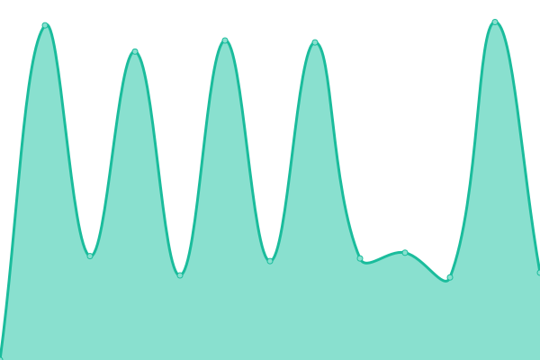
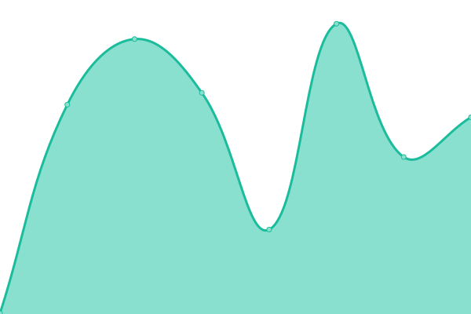
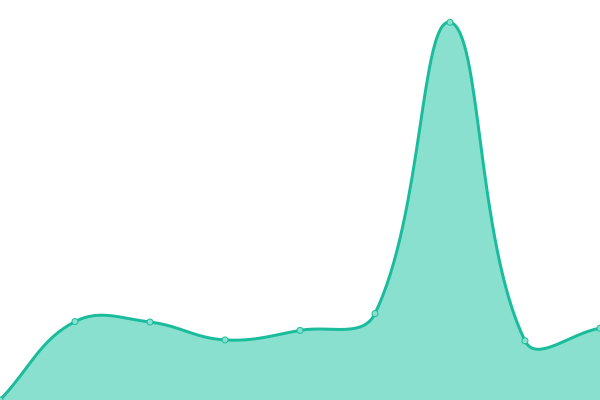

# [📈 Live Status](https://personlin.github.io/website_uptime): <!--live status--> **🟧 Partial outage**

This repository contains the open-source uptime monitor and status page for [Person](http://personlin.pixnet.net/blog), powered by [Upptime](https://github.com/upptime/upptime).

With [Upptime](https://upptime.js.org), you can get your own unlimited and free uptime monitor and status page, powered entirely by a GitHub repository. We use [Issues](https://github.com/personlin/website_uptime/issues) as incident reports, [Actions](https://github.com/personlin/website_uptime/actions) as uptime monitors, and [Pages](https://personlin.github.io/website_uptime) for the status page.

<!--start: status pages-->
<!-- This summary is generated by Upptime (https://github.com/upptime/upptime) -->
<!-- Do not edit this manually, your changes will be overwritten -->
<!-- prettier-ignore -->
| URL | Status | History | Response Time | Uptime |
| --- | ------ | ------- | ------------- | ------ |
|  [Google](https://www.google.com) | 🟩 Up | [google.yml](https://github.com/personlin/website_uptime/commits/HEAD/history/google.yml) | 

 118ms
     
 | 

<a href="https://personlin.github.io/website_uptime/history/google">100.00%</a>
    

|  [Sinotech](https://www.sinotech.org.tw) | 🟩 Up | [sinotech.yml](https://github.com/personlin/website_uptime/commits/HEAD/history/sinotech.yml) | 

 2624ms
     
 | 

<a href="https://personlin.github.io/website_uptime/history/sinotech">100.00%</a>
    

|  [Procal-tech](https://iot.procal-tech.com/iotportal/Login.aspx?ReturnUrl=%2fiotportal%2f) | 🟥 Down | [procal-tech.yml](https://github.com/personlin/website_uptime/commits/HEAD/history/procal-tech.yml) | 

 1017ms
     
 | 

<a href="https://personlin.github.io/website_uptime/history/procal-tech">99.83%</a>
    

|  [Earthquake information](https://earthquake.personlin.com/) | 🟩 Up | [earthquake-information.yml](https://github.com/personlin/website_uptime/commits/HEAD/history/earthquake-information.yml) | 

 350ms
     
 | 

<a href="https://personlin.github.io/website_uptime/history/earthquake-information">100.00%</a>
    

|  [Personlin.com](https://www.personlin.com/) | 🟥 Down | [personlin-com.yml](https://github.com/personlin/website_uptime/commits/HEAD/history/personlin-com.yml) | 

 264ms
     
 | 

<a href="https://personlin.github.io/website_uptime/history/personlin-com">0.00%</a>
    

|  [Prof. Yi-Ben Tsai](https://yibentsai.info/) | 🟩 Up | [prof-yi-ben-tsai.yml](https://github.com/personlin/website_uptime/commits/HEAD/history/prof-yi-ben-tsai.yml) | 

 187ms
     
 | 

<a href="https://personlin.github.io/website_uptime/history/prof-yi-ben-tsai">100.00%</a>
    

|  [GIS](http://gis.geo.ncu.edu.tw) | 🟩 Up | [gis.yml](https://github.com/personlin/website_uptime/commits/HEAD/history/gis.yml) | 

 1791ms
     
 | 

<a href="https://personlin.github.io/website_uptime/history/gis">98.79%</a>
    

<!--end: status pages-->

[**Visit our status website →**](https://personlin.github.io/website_uptime)

## 📄 License

- Powered by: [Upptime](https://github.com/upptime/upptime)
- Code: [MIT](./LICENSE) © [Person](http://personlin.pixnet.net/blog)
- Data in the `./history` directory: [Open Database License](https://opendatacommons.org/licenses/odbl/1-0/)
